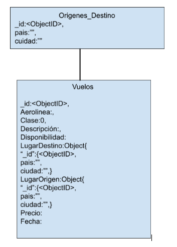

# ProyectoConcurrencias-Backend

Diagrama de la base de datos.

EndPoints

URL              |  Param  |                       Retorno                                      |  Descripción                                                  | 

| Vuelos/getAll | None | [
  {
    "id": "6029b87ab1b88c1ff0992d92",
    "disponibilidad": 80,
    "lugar_Origen": {
      "id": "60300cf21a60327fb57339e6",
      "pais": "Guatemala",
      "ciudad": "Antigua Guatemala"
    },
    "lugar_Destino": {
      "id": "60300cf21a60327fb57339e6",
      "pais": "Honduras",
      "ciudad": "San Pedro Sula"
    },
    "clase": 0,
    "precio": 0,
    "aerolinea": "AA",
    "descripcion": "La mejor",
    "fecha": "2015-09-01T15:20:00Z"
  }
] | Retorna Todos los vuelos disponibles que existan
                                      

Vuelos/getByOrigin | none |{
  "pais": "string",
  "ciudad": "string"
} | [
  {
    "id": "string",
    "disponibilidad": 0,
    "lugar_Origen": {
      "id": "string",
      "pais": "string",
      "ciudad": "string"
    },
    "lugar_Destino": {
      "id": "string",
      "pais": "string",
      "ciudad": "string"
    },
    "clase": 0,
    "precio": 0,
    "aerolinea": "string",
    "descripcion": "string",
    "fecha": "2021-02-23T04:37:03.923Z"
  }
] | Retorna los vuelos segun el origen                       

Vuelos/getByDestination| none | {
  "pais": "string",
  "ciudad": "string"
} | [
  {
    "id": "string",
    "disponibilidad": 0,
    "lugar_Origen": {
      "id": "string",
      "pais": "string",
      "ciudad": "string"
    },
    "lugar_Destino": {
      "id": "string",
      "pais": "string",
      "ciudad": "string"
    },
    "clase": 0,
    "precio": 0,
    "aerolinea": "string",
    "descripcion": "string",
    "fecha": "2021-02-23T04:37:03.923Z"
  }
] | Retorna los vuelos segun el Destino

Vuelos/getByDate/date | Vuelos/getByDate/"9/1/2015 09:20 AM" | [
  {
    "id": "string",
    "disponibilidad": 0,
    "lugar_Origen": {
      "id": "string",
      "pais": "string",
      "ciudad": "string"
    },
    "lugar_Destino": {
      "id": "string",
      "pais": "string",
      "ciudad": "string"
    },
    "clase": 0,
    "precio": 0,
    "aerolinea": "string",
    "descripcion": "string",
    "fecha": "2021-02-23T04:39:38.207Z"
  }
] | retorna todos los vuelos segun la fecha recibida por parametro
